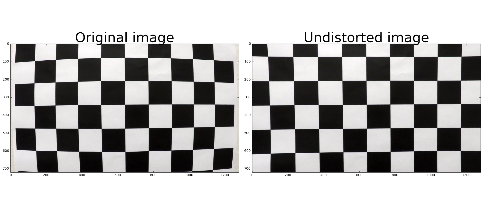
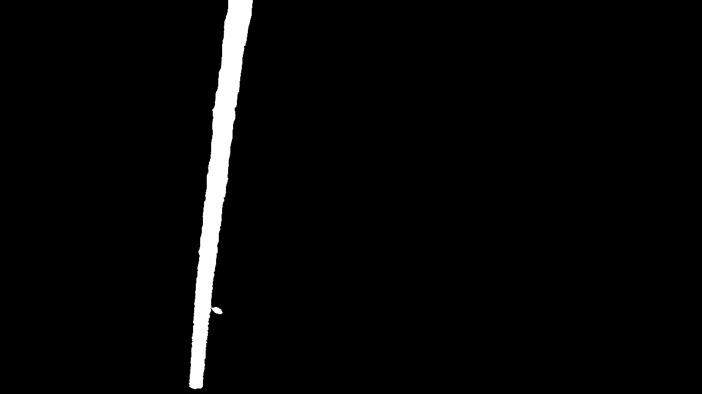
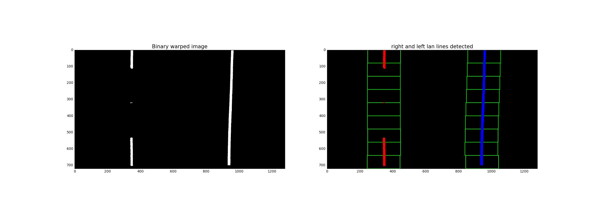
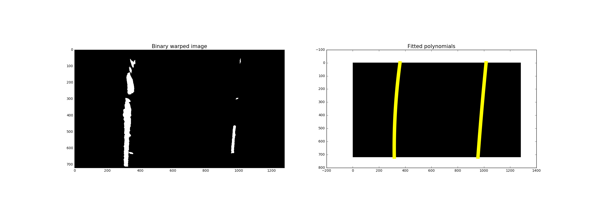

# Advanced Lane Finding 
Writing software pipeline to identify the lane boundaries in a video from a fron-facing camera on a car. 

## Pipeline architecture :
- Compute the camera calibration matrix and distortion coefficients given a set of chessboard images.
- Apply a distortion correction to raw images.
- Apply a perspective transform to warp undistorted image ("birds-eye view").
- Use color transforms, gradients, etc., to create a thresholded binary image.
- Detect lane pixels and fit 2nd order polynomial to them to find the lane boundary.
- Determine the curvature of the lane and vehicle position with respect to center.
- Warp the detected lane boundaries back onto the original image.
- Output visual display of the lane boundaries and numerical estimation of lane curvature and vehicle
position.

---

### Now let's get through each step in the pipeline in detail .

#### 1. Camera calibration :

opencv docs :

> Cameras convex lenses introduce a lot of distortion to images. Two major distortions are radial distortion and tangential distortion.  
Due to radial distortion, straight lines will appear curved. Its effect is more as we move away from the center of image.  
Another distortion is the tangential distortion which occurs because image taking lense is not aligned perfectly parallel to the imaging plane. So some areas in image may look nearer than expected. It is represented as below 


**Thus , camera must be calibrated first to correct the distortion in raw images** .    

The code for this step is contained in `calibrate_camera()` function.   
I start by preparing "object points", which will be the (x, y, z) coordinates of the chessboard corners in the world. Here I am assuming the chessboard is fixed on the (x, y) plane at z=0, such that the object points are the same for each calibration image. Thus, `objp` is just a replicated array of coordinates, and `objpoints` will be appended with a copy of it every time I successfully detect all chessboard corners in a test image. `imgpoints` will be appended with the (x, y) pixel position of each of the corners in the image plane with each successful chessboard detection.

#### Example of finding corners in chess board image 


I then used the output `objpoints` and `imgpoints` to compute the camera calibration and distortion
coefficients using the `cv2.calibrateCamera()` function. 

---

#### 2. Apply Distortion correction to raw images :

I applied this distortion correction by passing the camera matrix `mtx` and the distortion coefficients `dist`to `undistort_image()` function which uses  `cv2.undistort()` function then applied it to one of the chess board images used in calibration of camera and on test images and obtained this result:




---
### 3. Apply a perspective transform to warp undistorted image ("birds-eye view") :
A perspective transform maps the points in a given image to different, desired, image points with a new perspective. The perspective transform I used is the bird’s-eye view transform that let’s us view a lane from above ; this will be useful for the succeeding steps on.  
The code for this step is contained in `perspective_transform()` which takes as input an undistorted image and warps it in order to obtain the bird's eye view .  
I hardcoded the source points and the destination points as the following :
```

src_bottom_left = (0.5*w - 430 , h - 1)
src_top_left    = (0.5*w - 90  , 0.5*h + 120)
src_top_right   = (0.5*w + 90  , 0.5*h + 120)
src_bottom_right= (0.5*w + 470 , h - 1)

src_pts = np.array([src_bottom_left,src_top_left,src_top_right,src_bottom_right] , np.int32)

dst_bottom_left = (0.5*w - 300 , h - 1)
dst_top_left    = (0.5*w - 300 , 1)
dst_top_right   = (0.5*w + 300 , 1)
dst_bottom_right= (0.5*w + 300 , h - 1)

dst_pts = np.array([dst_bottom_left,dst_top_left,dst_top_right,dst_bottom_right] , np.int32)

```
This resulted in the following source and destination points :

Source | Destination
-------|------------
210 , 719 | 340 , 719
550 , 480 | 340 , 1
730 , 480 | 940 , 1
1110 , 719 | 940 , 719

The source and destination points can be used to calculate the transformation matrix which warps the original image to bird's eye view image as the following :
```
M = cv2.getPerspectiveTransform( src_pts , dst_pts )
warped = cv2.warpPerspective( original , M , (width,height) )
```

The source and destination points can be also used to calculate the inverse transformation matrix which unwarps the bird's eye view image back to the original image as the following :
 ```
 Minv = cv2.getPerspectiveTransform( dst_pts , src_pts )
unwarped = cv2.warpPerspective( warped , Minv , (width,height) )
```
I verified that my perspective transform was working as expected by drawing the src and dst points onto
a test image and its warped counterpart to verify that the lines appear parallel in the warped image.
 


I applied perspective transform on undistorted test images and obtained this results .

 

 ---
 ## 4. Use color transforms, gradients, etc., to create a thresholded binary image.
 wikipedia says :
>**Thresholding** is the simplest method of image segmentation . From a grayscale image, thresholding can be used to create binary image .  
The simplest thresholding methods replace each pixel in an image with a black pixel if the image intensity I[i,j] is less than some fixed constant T ( that is, I[i,j]  < T or a white pixel if the image intensity is greater than that constant. 

I used the following techniques to create binary images from the bird's eye view images :
* **Thresholding of B channel of LAB color space :** 
  * The code is contained in `color_threshold_l() function and here is the result I got
  * It does a good job in isolating white lane lines under varying lighting conditions .
  
  ---
* **Thresholding of L channel of LAB color space :** 
  * The code is contained in `color_threshold_b() function and here is the result I got
  * It does a good job in isolating yellow lane lines under varying lighting conditions .
  
  ---   
* **Combined thresholding of L and B channels of LAB color space :**
  * The code is contained in `color_threshold() function and here is the result I got
  * It does a better job in isolating both white and yellow lane lines under varying lighting conditions 
   rather than either thresholding in L or B channels individually .
   
  ---
* **Gradient thresholding applied to the saturation channel :**
  * The code is contained in `gradient_threshold()` function and by passing `'S'` to the parameter `channel` , the sobel operator is applied in x direction to the saturation channel in order to obtain the gradient of the saturation channel of the image in x direction and here is the result I got
   
  ---
  * **Gradient thresholding applied to the grayscale image :**
  * The code is contained in `gradient_threshold()` function and by passing `'G'` to the parameter `channel` , the sobel operator is applied in x direction to the grayscale image in order to obtain the gradient of the grayscale image in x direction and here is the result I got
   
  ---
  ## Conclusion :
  By looking at the above images and tunning parameters, We can see that color thresholding by combining color threshold in both `L` and `B` channels of `LAB` color space is doing very good on test images and gradient thresholding doesn't add that much value besides adding some jitter to the binary images .
    So, I'm going to choose color thresholding as the image thresholding technique to be used in detecting lane lines.    

    **Here is `image_threshold()` function** :
```
def image_threshold( image , l_thresh=(200,255) , b_thresh=(140,255)) :
    
    lab = cv2.cvtColor( image , cv2.COLOR_RGB2LAB)
    l_channel = lab[:,:,0]
    b_channel = lab[:,:,2]
    
    binary = np.zeros(image.shape[:2])
    binary[((l_channel>l_thresh[0]) & (l_channel<=l_thresh[1])) | ((b_channel>b_thresh[0]) & (b_channel<=b_thresh[1]))] =1
    
    return binary
```

When it's applied to warped test images , the following results are obtained .

 

---
## 5. Detect lane pixels and fit 2nd order polynomial to them to find the lane boundary.
### Identification of lane lines pixels :
Sliding windows method has been used to identify lane line pixels in the rectified binary image.  
Left and right lane lines pixels have been identified and colored in Red and blue respectively.  
The code for is step lies in the section entitled (sliding windows) .    

  1. Loop through each window in nwindows.  
  2. Find the boundaries of our current window. This is based on a combination of the current window's starting point (leftx_current and rightx_current), as well as the margin you set in the hyperparameters.  
  3. Use cv2.rectangle to draw these window boundaries onto our visualization image out_img. This is required for the quiz, but you can skip this step in practice if you don't need to visualize where the windows are.  
  4. Now that we know the boundaries of our window, find out which activated pixels from nonzeroy and nonzerox above actually fall into the window.  
  5. Append these to our lists left_lane_inds and right_lane_inds.  
  6. If the number of pixels you found in Step 4 are greater than your hyperparameter minpix, re-center our window (i.e. leftx_current or rightx_current) based on the mean position of these pixels.  





### Fitting curved lines to lane lines pixels :
The left and right pixels have been identified and fit with a curved functional form (e.g. 2nd order polynomials).
The resulted lane lines from fitting are drawn in yellow. 
The code for is step lies in the section entitled (Fitting 2nd order polynomials and drawing them) .  





---
## 6. Determine the curvature of the lane and vehicle position with respect to center.
Here the idea is to take the measurements of where the lane lines are and estimate how much the road is curving and where the vehicle is located with respect to the center of the lane.   
The radius of curvature may be given in meters assuming the curve of the road follows a circle.   
For the position of the vehicle, you may assume the camera is mounted at the center of the car and the deviation of the midpoint of the lane from the center of the image is the offset you're looking for. As with the polynomial fitting, convert from pixels to meters. 


```
def measure_curvature_real(linex , liney , y_val , ym_per_pix = 30/720 , xm_per_pix = 3.7/700):
        
  # Define conversions in x and y from pixels space to meters
  #ym_per_pix = 30/720 # meters per pixel in y dimension
  #xm_per_pix = 3.7/700 # meters per pixel in x dimension
  #####Implement the calculation of R_curve (radius of curvature) #####
  
  y_val = y_val * ym_per_pix
  
  fit = np.polyfit ( liney * ym_per_pix , linex * xm_per_pix , 2 )
  
  radius = ((np.power(1+np.square(2 * fit[0] * y_val + fit[1] ) , 3/2 ) ) /(np.absolute(2*fit[0]))) 
  
  return radius


def measure_vehicle_position( width , leftx , lefty , rightx , righty , y_val , ym_per_pix = 25/720 , xm_per_pix = 3.7/600) :

  # calculate the vehicle center in meters 
  # assuming the front-facing camera is mounted at the center of the vehicle

  vehicle_center = width//2 * xm_per_pix 
  
  right_fit = np.polyfit( righty , rightx , 2)
  left_fit  = np.polyfit( lefty  , leftx  , 2)

  # calculate x value for the right lane line at the bottom of the image in pixels space

  x_r = right_fit[0]*y_val**2 + right_fit[1] * y_val + right_fit[2]

  # calculate x value for the left lane line at the bottom of the image in pixels space

  x_l = left_fit[0] *y_val**2 + left_fit[1]  * y_val + left_fit[2]

  lane_center = ( (x_r + x_l) / 2 ) *xm_per_pix

  # calculate the distance of the vehicle from the lane center

  offset = vehicle_center - lane_center

  return offset

```
---

## 7. Warp the detected lane boundaries back onto the original image.  
The fit from the warped images has been warped back onto the original images and plotted to identify the lane boundaries. 


---
## 8. Output visual display of the lane boundaries and numerical estimation of lane curvature and vehicle position.
In addition to identifying lane boundaries and filling the lane area with green color , numerical estimation of lane curvature and vehicle position with respect to the lane center has been made and displayed. 


---

## Testing the pipeline on video :

I re-implemented the pipeline in an object-oriented programming .  
The code is found in the section with subject `Object-oriented programming` til the end of IPython notebook.  
The project video can be found [here](https://youtu.be/MYyT-4-DohA).    
The challenge video can be found here [here](https://youtu.be/UDoRWIMvaDU).   

---

## Discussion :
The issue  I've confronted that consumed some time and effort is to calibrate Bird's eye view transformation on straight lane lines so that warped images have parallel lines .
The pipeline may fail  when there are intense curved lines or highly-varying lighting conditions between shadows and intense light .

## Further improvement :
  Using Deep-learning CNNs to detect lane lines . This will help the pipeline gain more robustness against highly-varying lighting conditions and intense curved lane lines.